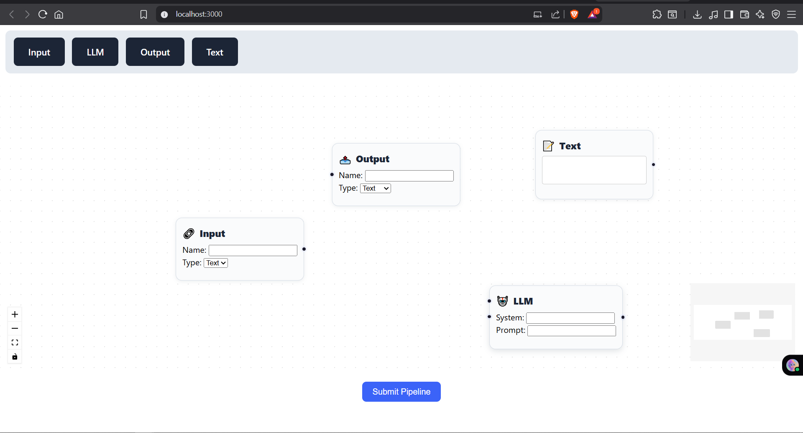
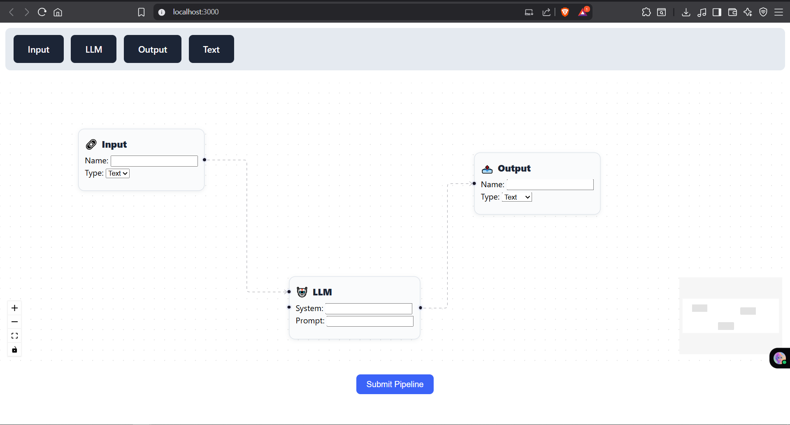
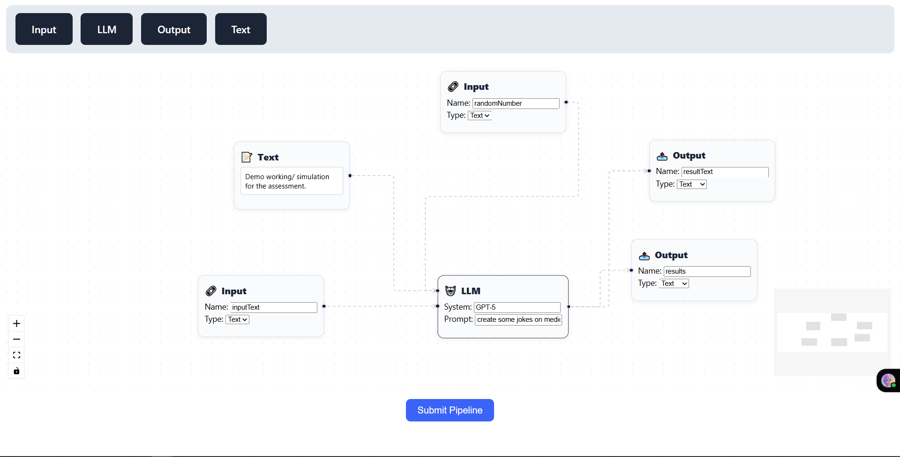
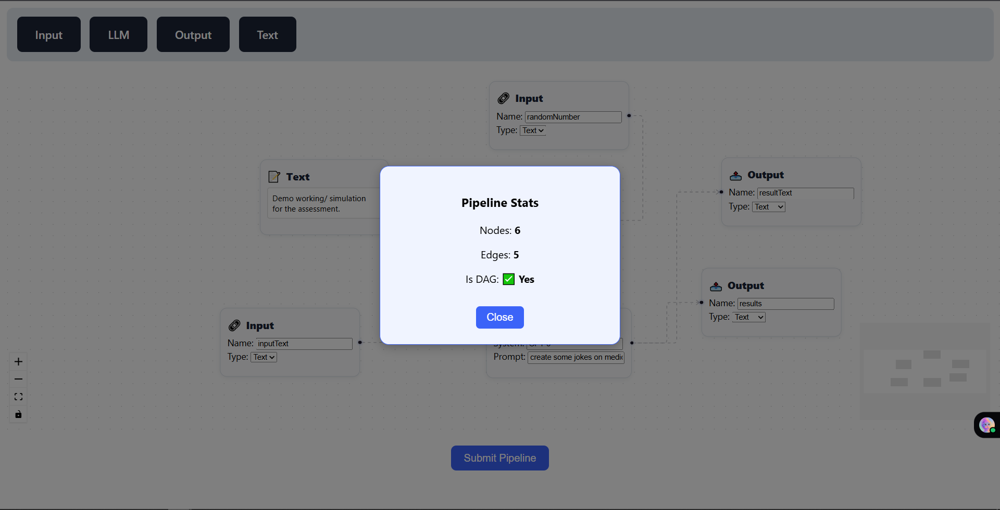
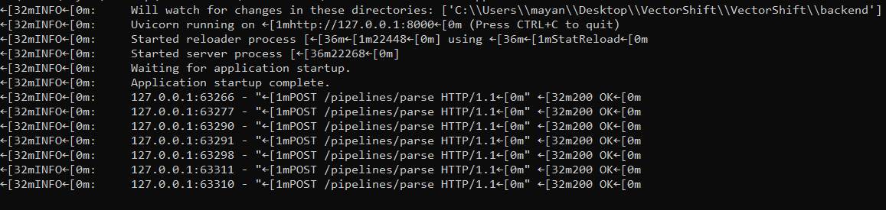

---

# VectorShift

**Pipeline Visualizer and Analyzer** built with **React (Frontend)** and **FastAPI (Backend)**

---

## 📌 Project Overview

VectorShift is a **no-code pipeline visualizer and analyzer** that allows users to:

* Build and submit interactive **pipeline graphs** in a React-based UI.
* Process pipelines on a FastAPI backend that validates **DAG (Directed Acyclic Graph) structure**.
* Receive **real-time feedback** with pipeline statistics and validation results.

This project was developed as part of a **technical assessment for VectorShift**.

---

## 📂 Repository Structure

```
/
├── backend/                # FastAPI backend code
│   ├── main.py             # Entry point for FastAPI application
│   ├── requirements.txt    # Backend dependencies
│   └── runtime.txt         # Python version (optional, for deployment)
├── frontend/               # React frontend code
│   ├── src/                # Source files for React app
│   ├── public/             # Public assets
│   └── package.json        # Frontend dependencies & config
└── README.md               # Documentation
```

---

## ✅ Prerequisites

* **Python 3.10+** (for backend)
* **Node.js (16+) & npm / yarn** (for frontend)

---

## ⚙️ Backend Setup (FastAPI)

1. Navigate to the backend directory:

   ```bash
   cd backend
   ```

2. (Optional) Create and activate a virtual environment:

   ```bash
   python -m venv venv
   source venv/bin/activate     # On Windows: venv\Scripts\activate
   ```

3. Install dependencies:

   ```bash
   pip install -r requirements.txt
   ```

4. Run the FastAPI server:

   ```bash
   uvicorn main:app --reload
   ```

5. Open API docs in your browser: [http://127.0.0.1:8000/docs](http://127.0.0.1:8000/docs)

---

## 🎨 Frontend Setup (React)

1. Navigate to the frontend directory:

   ```bash
   cd frontend
   ```

2. Install dependencies:

   ```bash
   npm install
   # or
   yarn install
   ```

3. Start the development server:

   ```bash
   npm start
   # or
   yarn start
   ```

4. Open the app in your browser: [http://localhost:3000](http://localhost:3000)

📸 **Responses:**



*(Screenshot of the React app home/dashboard)*

---

## 🚀 Usage

* Build your pipeline visually in the React frontend.
* Click **Submit Pipeline** to send nodes and edges to the FastAPI backend.
* View:

  * ✅ Node & edge count
  * ✅ DAG validation status
  * ✅ Error messages (if invalid)

📸 **Response:**

*(Screenshot of a sample pipeline graph being submitted and results modal)*

---

## 🔗 API Endpoint

* **POST** `/pipelines/parse` → Accepts pipeline data (nodes & edges) and returns validation + stats.
* **CORS** is configured for local development.

📸 **Response:**


```json
{
  "nodes": 4,
  "edges": 3,
  "is_dag": true
}
```

---

## 📝 Notes

* Designed for **local development & assessment**.
* Deployment not ready.
* Refer to code comments for deeper implementation details.
* A screen recording is included with the submission for demo purposes.

---

## 📬 Contact

**Author:** Mayank Negi
For any questions or clarifications, please reach out via the contact details shared with the submission.

---
